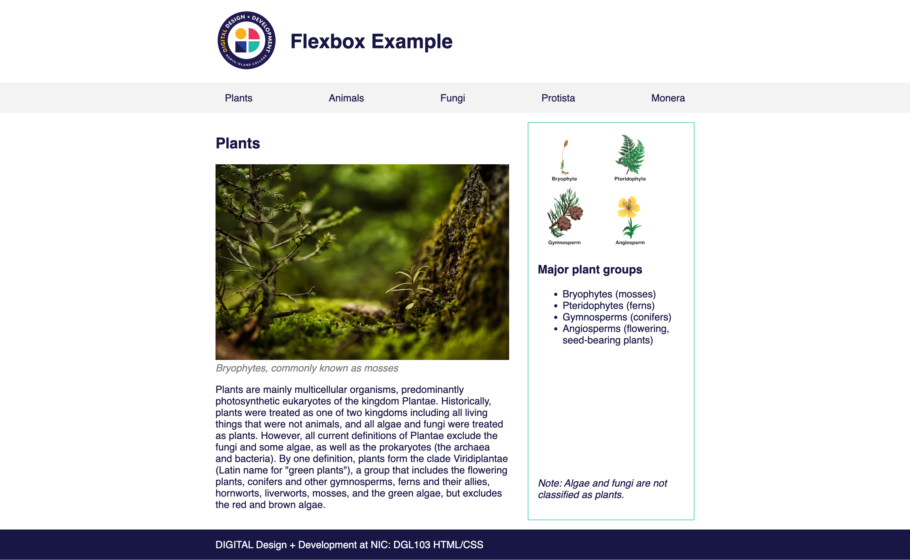

# Extra Flexbox Exercise

Edit plants.html to recreate the layout in the image below using flexbox. All the images you need are in the images folder. Your styles need to be in a separate stylesheet. 

The width of the content is 900px and it sits in the center of the screen, regardless of the screen size.

You will need to use flexbox to:

* Align the image and heading in the header
* Make the list items in the nav sit side-by-side and make them spread evenly across the width of the content.
* Make the main and aside elements sit side-by-side
* Align the note to the bottom of the aside

You are not allowed to work with other students on this exercise. Your work must be entirely your own.

